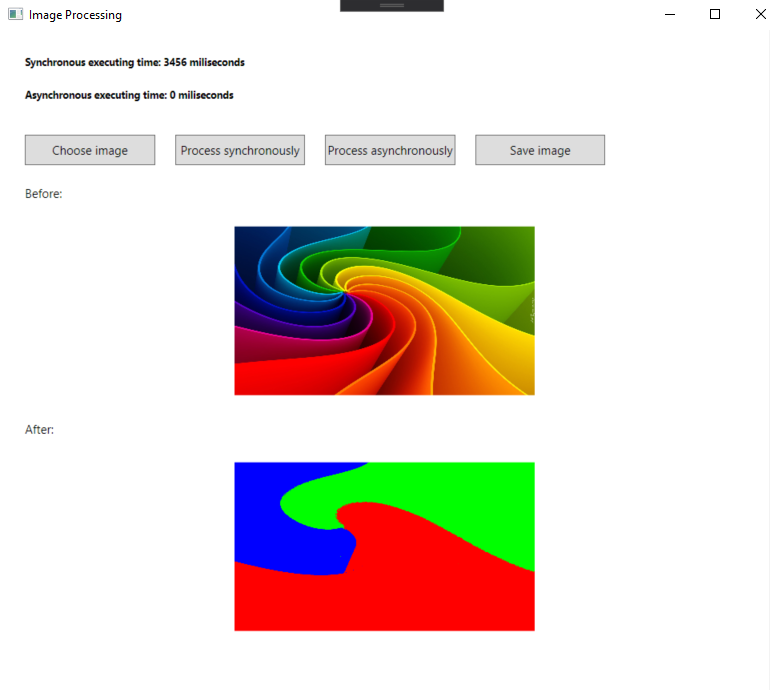

# ImageProcessing WPF 

1. Napisać od podstaw bibliotekę zawierającą klasę ImageProcessing, która umożliwia wczytanie zdjęcia (JPG,PNG,BMP) jego obróbkę i zapis. Klasa ma zawierać metodę ToMainColors zamieniającą kolorowy obraz o dowolnym rozmiarze na obraz, którego każdy pixel otrzymuje kolor zgodnie z procedurą:

   - rozkładamy kolor bieżącego pixela na składowe (R, G, B)

   - wybieramy największą z trzech liczb R, G i B

   - jeżeli w poprzednim kroku wybraliśmy:

    * R to nowym kolorem jest #FF0000

    * G to nowym kolorem jest #00FF00

    * B to nowym kolorem jest #0000FF

   Napisać wersję synchroniczną i asynchroniczną tej funkcji, dbając o możliwie największą wydajność obliczeniową.

2. Napisać aplikację WPF działającą w modelu MVVM, która będzie:

     - umożliwiała wczytanie obrazka z dysku w dowolnym formacie (JPG, PNG, BMP)

     - wyświetlała wczytany obrazek

     - umożliwiała zmianę kolorów obrazka zgodnie z procedurą z punktu 1. (metoda ToMainColors) i dla zastosowania funkcji ToMainColors w wersji synchronicznej i asynchronicznej:

     - wyświetli obrazek po zmianie kolorów

     - wypisze czas przetwarzania obrazka na nowe kolory.

3. Napisać przykładowe testy jednostkowe dla ViewModelu aplikacji z punktu 2. oraz biblioteki z punktu 1.
